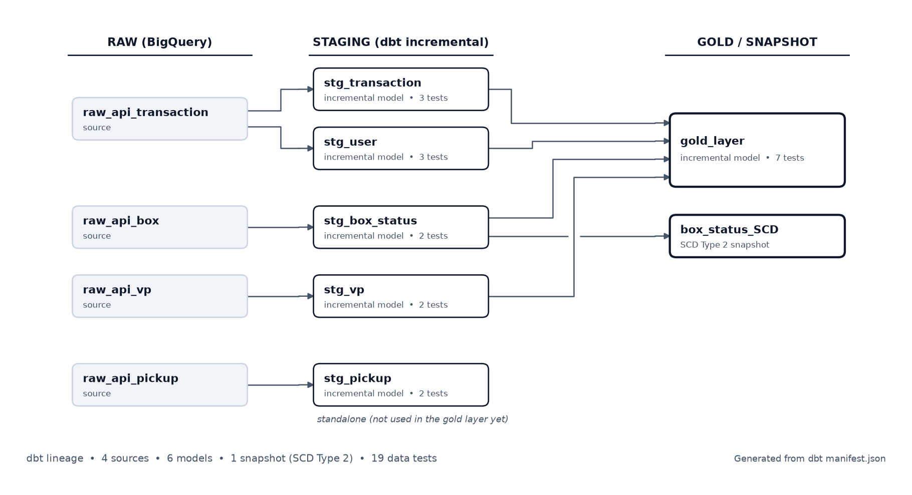

# ELT Pipeline — Multi-Source REST API to BigQuery

An incremental ELT pipeline that ingests data from four REST API sources into BigQuery, models it with dbt (staging and gold layers), tracks history with an SCD Type 2 snapshot, and ships with data tests. Built with Python and dbt Core, designed to run on Cloud Run.

> This repository is a sanitized portfolio version of a production pipeline. Company-specific identifiers (API endpoints, GCP project, dataset names) are replaced with environment variables and placeholder values. No credentials are included.

---

## Architecture

```
REST APIs (4 sources)
    │  incremental extract (watermark) · pagination · retry
    ▼
BigQuery Raw Layer        (raw JSON payload + ingested_at)
    │  dbt build: staging models (JSON parsing, typing, dedup, incremental merge)
    │  dbt snapshot: SCD Type 2 on api_box
    ▼
BigQuery Gold Layer       (transaction fact enriched with box, user, and partner attributes)
    │
    ▼
BI tools (Looker Studio, Power BI)
```

**Orchestration:** `pipeline.py` runs ingestion and then `dbt build` for one source per invocation. In production it was scheduled with Cloud Scheduler triggering Cloud Run.

---

## Data lineage



The diagram is generated from the dbt `manifest.json` (`dbt parse`), so it always matches the project: 4 sources, 6 models, 1 snapshot, and 19 data tests. Regenerate it with:

```bash
cd transform && dbt parse
python docs/make_lineage.py target/manifest.json docs/lineage.png
```

---

## Tech Stack

`Python` `requests` `google-cloud-bigquery` `dbt Core (BigQuery adapter)` `Docker` `Cloud Run` `Cloud Scheduler` `Artifact Registry`

---

## What this demonstrates

- **Incremental load with a watermark.** Each source reads the latest `updated_at` already in BigQuery (minus a safety window) and only fetches newer records.
- **Memory-efficient pagination.** Extract functions are Python generators (`yield`), so rows stream into the loader in batches instead of being held in memory.
- **Resilient API calls.** Bounded retries (`MAX_RETRY`), structured logging, and a fail-fast check for a missing token.
- **Incremental dbt models.** `materialized='incremental'` with `unique_key`, day partitioning, clustering, and `incremental_predicates` to limit the merge scan.
- **JSON-to-columns modeling.** Raw payloads are parsed with `JSON_VALUE` and `SAFE_CAST` into typed staging tables, then deduplicated with `ROW_NUMBER()`.
- **Timezone handling.** UTC timestamps converted to local time (`Asia/Jakarta`) in the gold layer, with a derived `duration_minute` metric.
- **SCD Type 2.** A dbt snapshot (`check` strategy on `status`, `box_error_code`, `box_error_messages`) keeps the full history of box status changes.
- **Data tests.** 19 tests defined: `unique` and `not_null` on every business key, `relationships` between staging and gold, `accepted_values` on `vp_status`, and two singular tests (no negative durations, no join fan-out in the gold layer).

---

## Data quality tests

Defined in `transform/models/schema.yml` and `transform/tests/`.

| Layer | Tests |
|---|---|
| Staging (5 models) | `unique` + `not_null` on each key (`ta_id`, `box_id`, `_id`, `pickup_id`); `not_null` on `updated_at`; `relationships` from `stg_user` to `stg_transaction` (severity `warn`) |
| Gold (`gold_layer`) | `unique` + `not_null` on `ta_id`; `relationships` to `stg_transaction`; `not_null` on `ta_start_time_wib`; `accepted_values` on `vp_status` |
| Singular | `assert_gold_duration_non_negative`, `assert_gold_no_fan_out` |

Run them against your own BigQuery project:

```bash
cd transform
dbt test
```

The test definitions are validated with `dbt parse`. They have not been executed against production data in this sanitized repository.

---

## Project Structure

```
├── pipeline.py              # Orchestrator: ingestion + dbt build per source
├── ingestion/               # Extract and load scripts, one folder per source
│   ├── api_box/
│   ├── api_transaction/
│   ├── api_vp/
│   └── api_pickup/
├── transform/               # dbt project
│   ├── models/              # staging and gold models, schema.yml (tests)
│   ├── snapshots/           # SCD Type 2 (box status)
│   ├── tests/               # singular tests
│   └── profiles.yml         # BigQuery profile (OAuth, env-driven)
├── docs/                    # lineage diagram and its generator
├── requirements/
└── .env.example             # Required environment variables (no secrets)
```

---

## Configuration

Copy `.env.example` to `.env` and fill in your own values. Never commit `.env`.

| Variable | Purpose |
|---|---|
| `GCP_PROJECT_ID` | BigQuery project |
| `BQ_DATASET` | Base dataset name (staging and gold derive from it) |
| `API_TOKEN_TRX` | Bearer token for the source API |
| `API_BOX_API_URL`, `API_TRANSACTION_API_URL`, `API_VP_API_URL`, `API_PICKUP_API_URL` | Source endpoints |

Authentication to BigQuery uses Application Default Credentials (`gcloud auth application-default login`) locally, or the service account attached to Cloud Run.

---

## Usage

```bash
pip install -r requirements/requirements.txt

# Run the full pipeline (ingestion + dbt) for one source
python pipeline.py api_box

# Available sources: api_box, api_transaction, api_vp, api_pickup
```

---

## Roadmap

- Add source freshness checks.
- Add an intermediate layer and dimension tables for a documented star schema.
- Add a Dockerfile and a CI workflow (`dbt parse` and `dbt test`).
- Add schema validation of API payloads (for example with Pydantic).

---

**Risky Bintang Munggaran** · [LinkedIn](https://linkedin.com/in/riskybintang1996) · [GitHub](https://github.com/bintang1101512)
